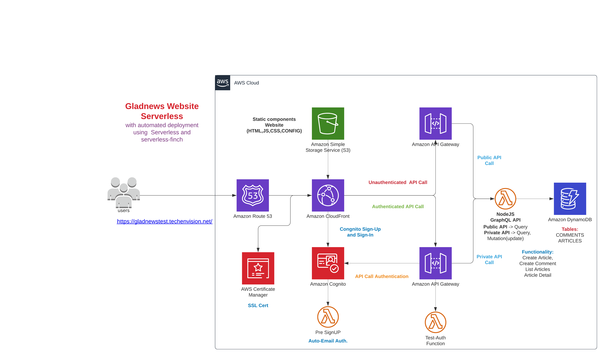

## Glad News:
A serverless project to share the news.
### Features
- Serverless-Finch to upload static website content to S3.
- Sign-In and Sign-Up using cognito.
- CloudFront distribution with SSL and Custom Domain Name.
- Route53 setup with CloudFront distribution.
- Lambda functon for Pre-signup trigger to auto authorise email id.
- Test Auth Lambda with API Authentication setup.
- GraphQL APIs (Public and Private) using Lambda Function.
- GraphQL Mutations to insert Article and Comment into DynamoDB.

