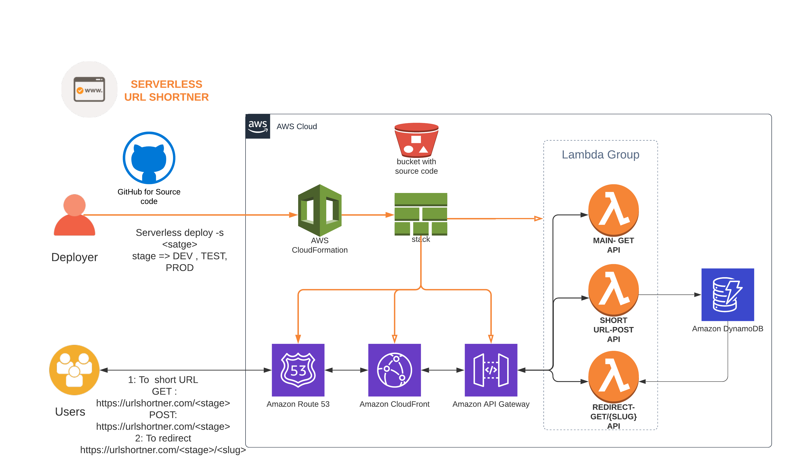
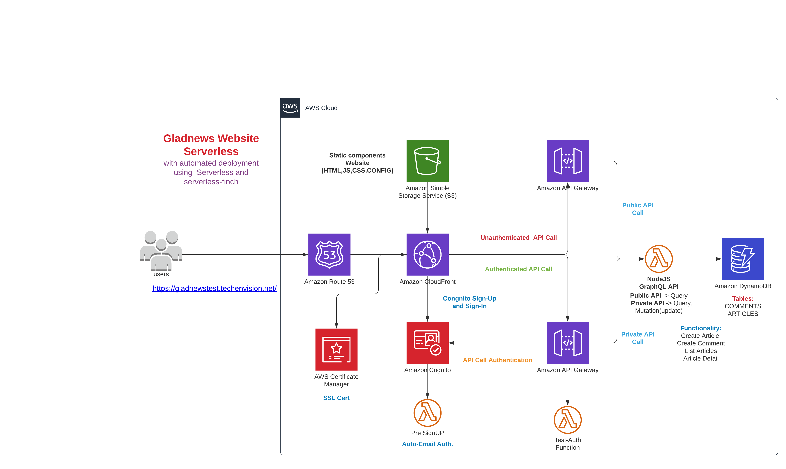

# Serverless-AWS-Acloudguru
Repository for the A Cloud Guru course *AWS: Serverless framework with GraphQL.*

## URL Shortener:
This is a complete serverless application created for shortening the URL.
### Features
URLShortener currently has the following features:

- Lambda Function: Main -> Screen for submitting the URL to shortening.
- Lambda Function: Create -> Function to submit the URL with its slug into DynamoDB.
- Lambda Function: redirect -> Function to redirect the shortened URL to actual URL.
- Setup Custom Domain Name with serverless-domain-manager plugin with SSL.
- Modify the script for Stage based deployment like PROD, DEV, TEST.

## Glad News:
A serverless project to share the news.
### Features
- Serverless-Finch to upload static website content to S3.
- Sign-In and Sign-Up using cognito.
- CloudFront distribution with SSL and Custom Domain Name.
- Route53 setup with CloudFront distribution.
- Lambda functon for Pre-signup trigger to auto authorise email id.
- Test Auth Lambda with API Authentication setup.
- GraphQL APIs (Public and Private) using Lambda Function.
- GraphQL Mutations to insert Article and Comment into DynamoDB.

